# PDF Converter API - Complete Installation & Setup Guide

A comprehensive guide for installing, configuring, and optimizing the PDF to Image Converter API.

---

## 📋 Table of Contents

- [Prerequisites](#-prerequisites)
- [Installation](#-installation)
- [PDF Repair Tools](#-pdf-repair-tools-recommended)
- [Verification](#-verification)
- [Configuration](#-configuration)
- [Performance Tuning](#-performance-tuning)
- [Docker Setup](#-docker-setup)
- [Testing](#-testing)
- [Troubleshooting](#-troubleshooting)
- [Advanced Configuration](#-advanced-configuration)

---

## 📦 Prerequisites

### Required Software

#### 1. Java Development Kit (JDK) 17+

**Check if installed:**
```bash
java -version
```

**Install:**
- **Windows**: Download from [Adoptium](https://adoptium.net/) or use Chocolatey:
  ```powershell
  choco install openjdk17
  ```
- **Ubuntu/Debian**:
  ```bash
  sudo apt-get update
  sudo apt-get install openjdk-17-jdk
  ```
- **macOS**:
  ```bash
  brew install openjdk@17
  ```

---

#### 2. Apache Maven 3.6+

**Check if installed:**
```bash
mvn -version
```

**Install:**
- **Windows**: Download from [Maven](https://maven.apache.org/download.cgi) or use Chocolatey:
  ```powershell
  choco install maven
  ```
- **Ubuntu/Debian**:
  ```bash
  sudo apt-get install maven
  ```
- **macOS**:
  ```bash
  brew install maven
  ```

---

## 🚀 Installation

### Step 1: Clone Repository
```bash
git clone <repository-url>
cd pdf-converter-java
```

### Step 2: Build Project
```bash
# Clean build
mvn clean package

# Skip tests (faster)
mvn clean package -DskipTests
```

**Build output:** `target/pdf-converter-api.jar`

### Step 3: Run Application

**Option A: Run with Maven**
```bash
mvn spring-boot:run
```

**Option B: Run JAR directly**
```bash
java -jar target/pdf-converter-api.jar
```

**Option C: Run with custom JVM options**
```bash
java -Xmx2g -Xms512m -jar target/pdf-converter-api.jar
```

### Step 4: Verify API is Running
```bash
curl http://localhost:8080/health
```

Expected response:
```json
{
  "status": "healthy",
  "activeJobs": 0,
  "api": "running"
}
```

✅ **Basic installation complete!** The API is now ready for PDF conversion.

---

## 🛠️ PDF Repair Tools (Recommended)

For **100% page recovery** with corrupted/problematic PDFs, install external repair tools.

> **Note:** These tools are **optional** but highly recommended for production use.

---

### Windows Installation

#### Method 1: Chocolatey (Recommended)

```powershell
# Install QPDF (fast repair)
choco install qpdf

# Install Ghostscript (comprehensive repair)
choco install ghostscript

# Verify installation
qpdf --version
gs --version
```

#### Method 2: Manual Installation

**QPDF:**
1. Download from [https://qpdf.sourceforge.io/](https://qpdf.sourceforge.io/)
2. Install to `C:\Program Files\qpdf\`
3. Add to PATH: `C:\Program Files\qpdf\bin`

**Ghostscript:**
1. Download from [https://www.ghostscript.com/download/gsdnld.html](https://www.ghostscript.com/download/gsdnld.html)
2. Install to `C:\Program Files\gs\gs10.xx.x\`
3. Add to PATH: `C:\Program Files\gs\gs10.xx.x\bin`

**Add to PATH (Windows):**
```powershell
# PowerShell (Run as Administrator)
$env:Path += ";C:\Program Files\qpdf\bin;C:\Program Files\gs\gs10.02.1\bin"
setx /M PATH "$env:Path"
```

---

### Linux Installation

#### Ubuntu/Debian
```bash
sudo apt-get update
sudo apt-get install -y qpdf ghostscript

# Verify installation
qpdf --version
gs --version
```

#### CentOS/RHEL/Fedora
```bash
sudo yum install -y qpdf ghostscript

# Or with DNF
sudo dnf install -y qpdf ghostscript

# Verify installation
qpdf --version
gs --version
```

#### Arch Linux
```bash
sudo pacman -S qpdf ghostscript

# Verify installation
qpdf --version
gs --version
```

---

### macOS Installation

```bash
# Install via Homebrew
brew install qpdf ghostscript

# Verify installation
qpdf --version
gs --version
```

---

## ✅ Verification

### 1. Check Java & Maven
```bash
java -version    # Should show Java 17+
mvn -version     # Should show Maven 3.6+
```

### 2. Check PDF Repair Tools
```bash
qpdf --version   # Should show QPDF version
gs --version     # Should show Ghostscript version
```

### 3. Check API Startup

After starting the API, look for this message in console:

✅ **With repair tools installed:**
```
PDF Repair Tools:
  QPDF: ✓ Available (version 11.x.x)
  Ghostscript: ✓ Available (version 10.x.x)
```

⚠️ **Without repair tools:**
```
PDF Repair Tools:
  QPDF: ✗ Not found
  Ghostscript: ✗ Not found
```

### 4. Test API Endpoints
```bash
# Health check
curl http://localhost:8080/health

# API help
curl http://localhost:8080/api/help

# Test conversion
curl -X POST http://localhost:8080/api/convert \
  -F "pdf=@sample.pdf" \
  -F "dpi=150"
```

---

## ⚙️ Configuration

### Basic Configuration

Edit `src/main/resources/application.properties`:

```properties
# ===========================================
# Server Configuration
# ===========================================
server.port=8080

# ===========================================
# File Upload Configuration
# ===========================================
spring.servlet.multipart.enabled=true
spring.servlet.multipart.max-file-size=50MB
spring.servlet.multipart.max-request-size=50MB

# ===========================================
# Storage Configuration
# ===========================================
app.upload.dir=uploads
app.output.dir=outputs

# ===========================================
# Job Management
# ===========================================
app.job.expiry-hours=1

# ===========================================
# PDF Repair Configuration
# ===========================================
# Enable/disable repair functionality
app.repair.enabled=true

# Tool paths (auto-detected from system PATH)
app.repair.qpdf.path=qpdf
app.repair.ghostscript.path=gs

# Repair timeout (seconds)
app.repair.timeout-seconds=300

# Repair threshold (skip repair if failure rate is below this %)
app.repair.threshold-percent=2.0
```

---

### Custom Tool Paths

If tools are not in system PATH, configure absolute paths:

**Windows:**
```properties
app.repair.qpdf.path=C:/Program Files/qpdf/bin/qpdf.exe
app.repair.ghostscript.path=C:/Program Files/gs/gs10.02.1/bin/gswin64c.exe
```

**Linux/macOS:**
```properties
app.repair.qpdf.path=/usr/local/bin/qpdf
app.repair.ghostscript.path=/usr/local/bin/gs
```

---

### Environment Variables

You can also configure via environment variables:

```bash
# Linux/macOS
export SERVER_PORT=9090
export APP_REPAIR_ENABLED=true
export APP_REPAIR_QPDF_PATH=/usr/local/bin/qpdf

# Windows PowerShell
$env:SERVER_PORT="9090"
$env:APP_REPAIR_ENABLED="true"
```

---

## 🚀 Performance Tuning

### JVM Heap Size

For large PDFs or high concurrency:

```bash
# 2GB heap
java -Xmx2g -Xms512m -jar target/pdf-converter-api.jar

# 4GB heap (for very large PDFs)
java -Xmx4g -Xms1g -jar target/pdf-converter-api.jar
```

### Concurrent Job Processing

Edit `application.properties`:

```properties
# Spring Boot Thread Pool
server.tomcat.threads.max=200
server.tomcat.threads.min-spare=10
```

### File Upload Limits

For large PDFs:

```properties
spring.servlet.multipart.max-file-size=100MB
spring.servlet.multipart.max-request-size=100MB
```

---

## 🐳 Docker Setup

### Option 1: Basic Dockerfile

Create `Dockerfile`:

```dockerfile
FROM openjdk:17-jdk-slim

# Install PDF repair tools
RUN apt-get update && \
    apt-get install -y qpdf ghostscript && \
    rm -rf /var/lib/apt/lists/*

# Copy JAR
WORKDIR /app
COPY target/pdf-converter-api.jar app.jar

# Expose port
EXPOSE 8080

# Run
ENTRYPOINT ["java", "-jar", "app.jar"]
```

**Build and run:**
```bash
mvn clean package
docker build -t pdf-converter-api .
docker run -p 8080:8080 pdf-converter-api
```

---

### Option 2: Docker Compose

Create `docker-compose.yml`:

```yaml
version: '3.8'

services:
  pdf-converter:
    build: .
    image: pdf-converter-api:latest
    ports:
      - "8080:8080"
    volumes:
      - ./uploads:/app/uploads
      - ./outputs:/app/outputs
    environment:
      - SERVER_PORT=8080
      - APP_REPAIR_ENABLED=true
      - SPRING_SERVLET_MULTIPART_MAX_FILE_SIZE=50MB
    restart: unless-stopped

  # Optional: Nginx reverse proxy
  nginx:
    image: nginx:alpine
    ports:
      - "80:80"
    volumes:
      - ./nginx.conf:/etc/nginx/nginx.conf
    depends_on:
      - pdf-converter
```

**Run:**
```bash
docker-compose up -d
```

---

## 🧪 Testing

### Test 1: Basic Conversion (No Repair)

```bash
curl -X POST http://localhost:8080/api/convert \
  -F "pdf=@sample.pdf" \
  -F "dpi=150" \
  -F "format=jpg"
```

**Expected response:**
```json
{
  "jobId": "uuid-here",
  "status": "success",
  "metadata": {
    "totalPages": 10,
    "successfulPages": 10,
    "failedPages": 0,
    "timeTakenSeconds": 2.5
  }
}
```

---

### Test 2: Problematic PDF (With Repair)

```bash
curl -X POST http://localhost:8080/api/convert \
  -F "pdf=@corrupted.pdf" \
  -F "dpi=150"
```

**Without repair tools:**
```json
{
  "totalPages": 100,
  "successfulPages": 98,
  "failedPages": 2,
  "errors": ["Page 15: Recursion error", "Page 42: Invalid object"]
}
```

**With repair tools:**
```json
{
  "totalPages": 100,
  "successfulPages": 100,
  "failedPages": 0,
  "repairMethod": "qpdf",
  "totalTimeSeconds": 15.3
}
```

---

### Test 3: Download Output

```bash
# Get jobId from conversion response
JOB_ID="your-job-id-here"

# Download ZIP
curl -O http://localhost:8080/api/output/$JOB_ID

# Extract and verify
unzip $JOB_ID.zip
ls -lh
```

---

## 🎯 How Repair Works

### 3-Tier Repair Strategy

```mermaid
graph TD
    A[Upload PDF] --> B{Direct Conversion}
    B -->|Success| C[All Pages Converted ✅]
    B -->|Some Failures| D{QPDF Available?}
    D -->|Yes| E[QPDF Repair]
    E -->|Success| C
    E -->|Still Failures| F{Ghostscript Available?}
    F -->|Yes| G[Ghostscript Repair]
    G --> C
    D -->|No| H[Return Partial Results ⚠️]
    F -->|No| H
```



### Performance Comparison

**Example: 660-page PDF**

| Strategy | Time | Success Rate | When to Use |
|----------|------|--------------|-------------|
| **No repair** | 12s | 98.3% (649/660) | Clean PDFs, speed priority |
| **QPDF** | ~20s | 100% (660/660) ✅ | Standard repair, balanced |
| **Ghostscript** | ~50s | 100% (660/660) ✅ | Severely corrupted PDFs |

✅ **Smart repair**: Only triggers when needed (no penalty for clean PDFs)

---

## 🔧 Troubleshooting

### Issue 1: "PDF repair tools not found"

**Symptoms:**
```
PDF Repair Tools:
  QPDF: ✗ Not found
  Ghostscript: ✗ Not found
```

**Solutions:**

1. **Verify installation:**
   ```bash
   qpdf --version
   gs --version
   ```

2. **Check PATH:**
   ```bash
   # Linux/macOS
   echo $PATH
   which qpdf
   which gs

   # Windows
   echo %PATH%
   where qpdf
   where gs
   ```

3. **Manual paths in config:**
   ```properties
   app.repair.qpdf.path=/full/path/to/qpdf
   app.repair.ghostscript.path=/full/path/to/gs
   ```

4. **Restart API** after configuration changes

---

### Issue 2: "File too large"

**Error:** `413 Payload Too Large`

**Solution:**
```properties
spring.servlet.multipart.max-file-size=100MB
spring.servlet.multipart.max-request-size=100MB
```

---

### Issue 3: "Repair timeout"

**Error:** `Repair operation timed out`

**Solution:**
```properties
# Increase timeout for large PDFs
app.repair.timeout-seconds=600  # 10 minutes
```

---

### Issue 4: "Port already in use"

**Error:** `Port 8080 is already in use`

**Solution:**
```properties
server.port=9090
```

Or stop the conflicting process:
```bash
# Linux/macOS
lsof -i :8080
kill -9 <PID>

# Windows
netstat -ano | findstr :8080
taskkill /PID <PID> /F
```

---

### Issue 5: "Out of memory"

**Error:** `java.lang.OutOfMemoryError: Java heap space`

**Solution:**
```bash
# Increase JVM heap
java -Xmx4g -jar target/pdf-converter-api.jar
```

---

### Issue 6: "Job not found"

**Error:** `404 - Job not found`

**Cause:** Job expired (default: 1 hour)

**Solution:**
```properties
# Increase expiry time
app.job.expiry-hours=24
```

---

## 🎓 Advanced Configuration

### Custom Storage Paths

```properties
# Absolute paths
app.upload.dir=/var/app/uploads
app.output.dir=/var/app/outputs

# Relative paths (from working directory)
app.upload.dir=./data/uploads
app.output.dir=./data/outputs
```

---

### Logging Configuration

Create `logback-spring.xml`:

```xml
<configuration>
    <appender name="FILE" class="ch.qos.logback.core.rolling.RollingFileAppender">
        <file>logs/pdf-converter.log</file>
        <rollingPolicy class="ch.qos.logback.core.rolling.TimeBasedRollingPolicy">
            <fileNamePattern>logs/pdf-converter-%d{yyyy-MM-dd}.log</fileNamePattern>
            <maxHistory>30</maxHistory>
        </rollingPolicy>
        <encoder>
            <pattern>%d{HH:mm:ss.SSS} [%thread] %-5level %logger{36} - %msg%n</pattern>
        </encoder>
    </appender>

    <root level="INFO">
        <appender-ref ref="FILE" />
    </root>
</configuration>
```

---

### Production Deployment

**systemd service** (Linux):

Create `/etc/systemd/system/pdf-converter.service`:

```ini
[Unit]
Description=PDF Converter API
After=network.target

[Service]
Type=simple
User=app-user
WorkingDirectory=/opt/pdf-converter
ExecStart=/usr/bin/java -Xmx2g -jar /opt/pdf-converter/pdf-converter-api.jar
Restart=on-failure
RestartSec=10

[Install]
WantedBy=multi-user.target
```

**Enable and start:**
```bash
sudo systemctl enable pdf-converter
sudo systemctl start pdf-converter
sudo systemctl status pdf-converter
```

---

## 📊 Summary

### Quick Reference

| Component | Required | Purpose |
|-----------|----------|---------|
| Java 17+ | ✅ Yes | Runtime environment |
| Maven 3.6+ | ✅ Yes | Build tool |
| QPDF | ⭐ Recommended | Fast PDF repair |
| Ghostscript | ⭐ Recommended | Comprehensive repair |
| Docker | ❌ Optional | Containerization |

---

### Recommended Setup

1. ✅ Install Java 17+ and Maven
2. ✅ Install QPDF and Ghostscript for production
3. ✅ Configure custom paths if needed
4. ✅ Tune JVM heap size based on PDF sizes
5. ✅ Set appropriate file upload limits
6. ✅ Configure job expiry based on use case

---

**Ready to convert PDFs! 🚀**

For API usage, see [README.md](README.md)
